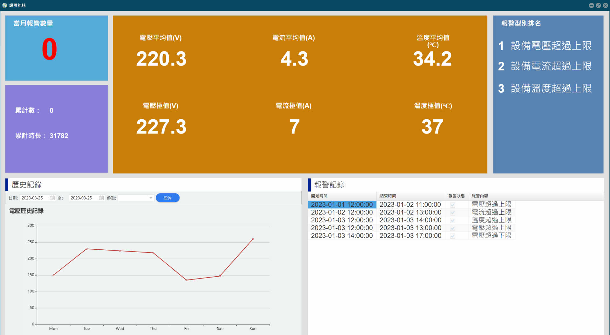

# 燈號管理
工廠產線管理的可視化工具，利用三色燈進行生產線數據的採集，實現機台聯網也日漸普及；它同時也是目前導入成本最低、彈性最大並有效提升產能的無痛選擇，透過綠、黃、紅三色分別代表正常運作、警告以及無法運作的三種訊號，瀏覽機台設備的稼動率及生產進度的控管，無需重金導入全新的智慧機械。

> **加入 Facebook 社團**
>
> [https://www.facebook.com/groups/isoface/](https://www.facebook.com/groups/isoface/)
> 
> **點讚追蹤 Facebook 粉絲專頁**
> 
> [https://www.facebook.com/AIOT.ERP](https://www.facebook.com/AIOT.ERP)

燈號管理無技術門檻，不用漫長的開發時間，容易操作，以低成本的導入方式架設智慧化工廠。它是工廠管理的可視化工具。隨著工業4.0的發展，利用燈號進行生產線數據的採集，實現機台聯網也日漸普及；它同時也是目前導入成本最低、彈性最大並有效提升產能的無痛選擇，透過綠、黃、紅三色分別代表正常運作、警告與無法運作的三種訊號，就可以看到機台設備的稼動率及生產進度的控管，不見得要花費重金導入全新的智慧機械。為了協助快速導入智慧工廠，整理在工廠燈號管理的作業方式，期望能應用在智慧工廠專案開發，拓展在工業物聯網的應用。

機台生產相關數據自動採集，例如機台運轉燈號與能耗狀況。節省巡檢工時與人力作業，縮短反應時間及制定決策。異常監控預警機制，建立具製造彈性、速度、高效高品質的智慧製造現場。快速生產管理即時監控現場生產狀況，支援回覆或建議行動，協助管理人員排程機台調度，優化產線設備稼動率。

　　管理人員要掌握工廠產線上機台的狀況，包括機台閒置時間，發生問題是否即時處理，有多少機台總是修不好，花了多久的待料時間，如何單獨管理多台設備，建置燈號管理系統所需成本，設備老舊的機台是否有使用上的限制，生產排程該如何規劃，產線上的設備稼動率如何一目瞭然，如何升級數據化管理。燈號管理系統專門解決上述種種困擾。

## 特色

* 產線戰情室，統計整廠設備，稼動率一目瞭然。整合第三方軟體，例如：ERP、MES、CRM等。加速智慧工廠數位轉型，自動化流程節省人力、數據管理更輕鬆。
* 稼動率可視化介面，適用於廠區各式三色燈設備，利用傳感器採集數據，整合各種數據，顯示設備機台狀況，並換算稼動率，運用圖形化數據管理，更容易了解產線狀況。
* 採用網頁Web介面，適用於各種瀏覽器，跨平台支援各種作業系統。只需連接網址，不限使用人數，在家也可查看。也可搭配各式手機、平板電腦，實時掌握產線狀況。
* 自由選擇本地或雲端運用，不管是儲存至本地端主機或是雲端進行管理都有安全防護，並可避免因為傳輸儲存方式、甚至是侷限硬體廠牌等所發生的各種限制。
* 可逐步擴展新增採集點，採集點不用一步到位，系統的彈性架構，傳感器安裝簡單，工廠可自行擴展新增採集點。
* 自訂稼動率門檻，幫助優化產線稼動，提供欄位可設定稼動率門檻。使用者可根據特定設備設定稼動率門檻管理，一旦低於稼動率，系統顯示紅燈，提醒查修，幫助工廠提升稼動率及產量。
* 快速抓出稼動異常，單日稼動查詢，快速抓出稼動異常機台。產線閒置時間過久？發現設備異常卻沒有及時處理？這些狀況都會導致隱性成本增加，利用燈號管理系統單日稼動查詢功能，快速找出稼動異常的設備，提高產線運轉效益。
* 稼動趨勢查詢，掌握機台運轉效益。工廠產線上的機台看起來每天都有運轉，但是停機次數過於頻繁，設備的運轉效益正在下滑嗎？燈號管理提供各機台稼動趨勢查詢，統計設備長時間的稼動趨勢，掌握每部機台的長期的運轉效益。
* 提供分析管理數據，歷史報表查詢，能夠選擇特定區間報表查詢，免去翻找大量不必要的資訊以及需要整理的龐大前置作業，並且回溯歷史資料更容易，查詢更加方便。

設備實動率︰查詢固定期間，設備運行時間佔開機時間的百分比。這代表設備的使用效率，是反映設備工作狀態及生產效率。

設備開機率︰查詢固定期間，設備運行時間佔每天時間的百分比。這代表設備的使用效率，是反映設備工作狀態及生產效率。

OEE多機時序︰依據每日時間順序提列單一設備運行狀況

OEE單機時序︰依據每日時間順序提列多種設備運行狀況

設備稼動趨勢圖︰掌握設備長期的運轉效益

設備能耗︰監控設備能源使用狀況
